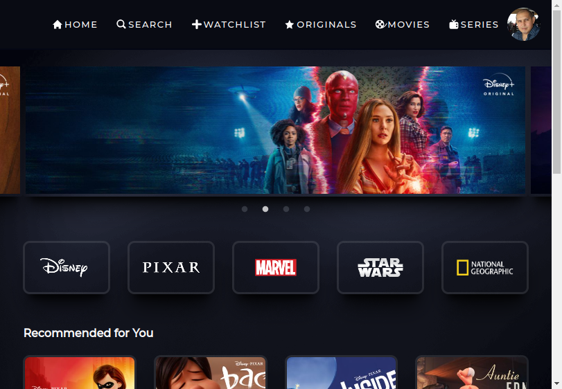

# Disney+ Clone em React

Essa aplicação é um clone da plataforma do Disney+, desenvolvido em React.

Aplicação que consiste em logar com a conta google, e após a autenticação, ver a página inicial com alguns carrosséis de filmes em destaque e uma lista de filmes por categoria.

O projeto foi desenvolver uma aplicação em React, consumindo os dados do firebase para obter informações sobre os filmes e séries.

## 🚀 Tecnologia

- ⚡ React é uma biblioteca JavaScript de código aberto focada na criação de interfaces de usuário em páginas da web.

- ⚡ JavaScript é uma linguagem de programação interpretada estruturada, de script em alto nível com tipagem dinâmica fraca e multiparadigma.

- ⚡ HTML é a linguagem base para se desenvolver qualquer site. 

- ⚡ Styled Components é uma biblioteca que possibilita escrever códigos CSS dentro do JavaScript.

## ✋🏻 Pré-requisitos

- [git](https://git-scm.com/downloads): Ferramenta para gerenciar o código-fonte

- [Visual Studio Code](https://code.visualstudio.com/): Editor de Código Fonte

- [React](https://reactjs.org/): Biblioteca JavaScript para criar interfaces de usuário

## :hammer_and_wrench: Antes de iniciar o projeto.

No diretório do projeto, instale as dependências e inicialize o projeto:

### `npm install`

Instala as dependências.

### `npm start`

Executa o aplicativo no modo de desenvolvimento.

Abra [http://localhost:3000](http://localhost:3000) para visualizá-lo em seu navegador.

